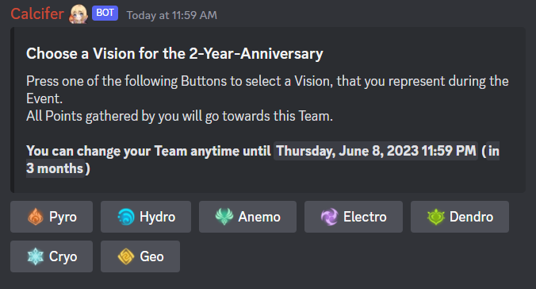
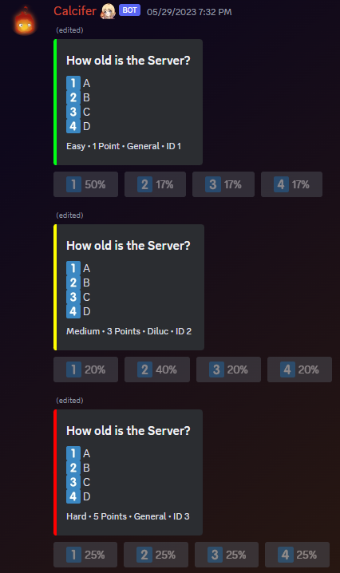
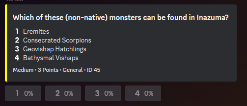
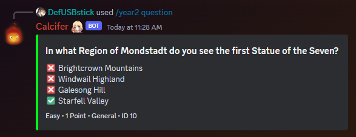
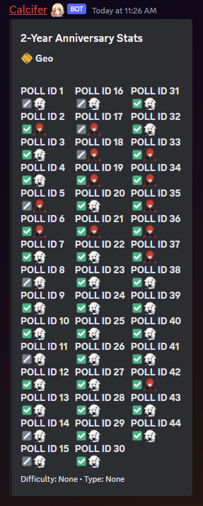
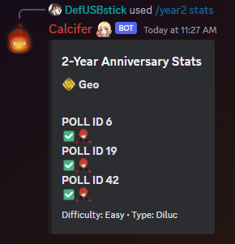

# Moderation Bot

This bot is made for a content Creator server and includes features such as live Subscriber Counter, automatic roles when meeting certain requirements in Genshin, Custom Levelsystem with Chat and Voice EXP and more. Below is a bit more Information about the Anniversary Code.

## Anniversary Events

### First Anniversary Event

Our first Discord anniversary event spanned over 2 weeks. Every 12 hours a new Poll/Quiz to vote got automatically posted. Reactions were used for vote collection, and at the end of each voting period, the results were stored in a dedicated JSON file. Correct answers earned participants points. At the end of the Event we provided a statistics tool to help track individual progress and published the final results of every team.

### Second Anniversary Event

For our second anniversary event, we maintained a similar structure but introduced notable enhancements. We replaced reactions with buttons to make voting more private. All Data is no longer stored in a JSON File. Instead we are now using a database. After the voting window closed, the number of votes was directly updated in the message. Two new categories of questions have been introduced. The statistics tool was expanded to allow filtering by categories and difficulty levels. Additionally all Questions posted now gave points depending on difficulty.

### Third Anniversary Event

> Future Plans
- Balancing System
  - Team sizes vary and thus the team with the most members would have an advantage
  - Next year a balancing system is planned to prevent this
- Changing Votes
  - During the Second Anniversary, it wasn't possible to change votes
  - With the Third Anniversary, we wanna introduce a way to change their vote a limited amount of times during the event

### Images

> Vision Selection

> Questions Variations

> Poll/Question Embed

> Questions Command

> Anniversary Stats without Filter

> Anniversary Stats with Filter
